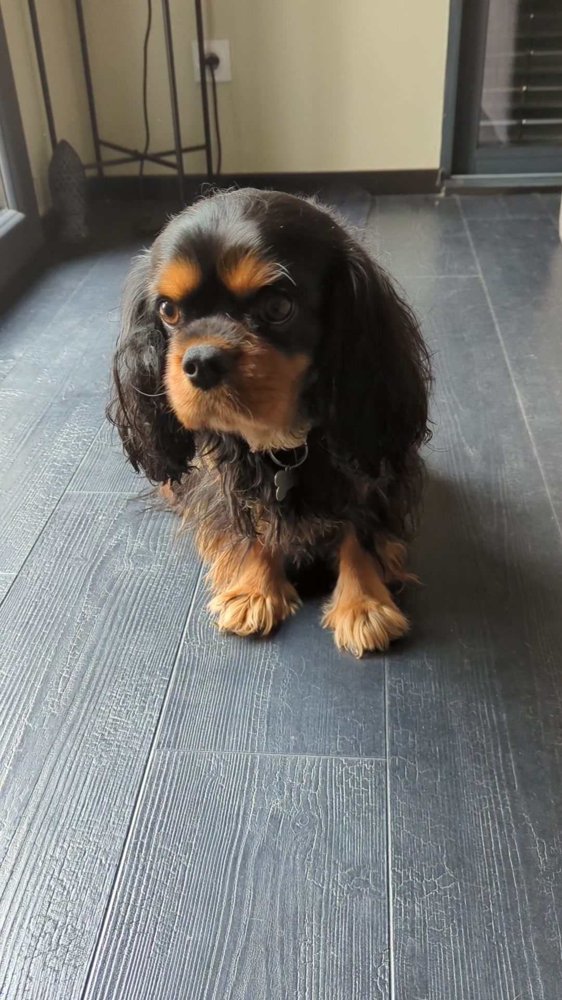

# AutoMiam


# Contexte

**AutoMiam** est un projet réalisé dans le cadre de l’enseignement *Smart Environments*, enseigné au sein du Master 2 Intelligence Artificielle de [l'université Claude Bernard Lyon 1](https://www.univ-lyon1.fr/). Il est encadré par [Lionel Medini](https://perso.liris.cnrs.fr/lionel.medini/enseignement/) et a pour sujet les objets connectés, l’internet des objets (*IoT*), et le web des objets (*WoT*).


# Objectif 

L'objectif du projet était de réaliser un pet feeder intelligent, capable d’identifier les animaux enregistrés, afin d’adapter son comportement pour chacun.   
  
Le système conçu peut délivrer de la nourriture, de manière automatique, aux animaux enregistrés qui s'en approche. Il identifie un animal avant de le nourrir, à l’aide d’une caméra, pour analyser ses besoins et lui fournir une dose de nourriture quotidienne adaptée. L'utilisateur peut enregistrer ses animaux dans le système et suivre leur consommation grâce à une interface web.  
  
Dans le cadre du projet, nous avons restreint les animaux aux chiens, et le nombre de chiens reconnus à deux : Mina et Jappeloup.

<center>
<table>
<tr>
<td>  </td>
<td>  </td>
</tr>
<tr>
<td align="center"> <i>Mina</i> </td>
<td align="center"> <i>Jappeloup</i> </td>
</tr>
</table>
</center>


# Architecture 

- `doc/` : Documents de rendu du projet
- `app/` : Contient les modules de l'application  
    - `ui/` : Interface web utilisateur
    - `dog-identifier/` : Serveur python pour identifier et gérer les chiens enregistrés
    - `pet-feeder/` : 
        - `thing/` : App Node.js pour exposer l'objet connecté
        - `controller/` : App Node.js pour consommer l'objet connecté


# Exécution
Pour exécuter le projet, il faut lancer trois modules : 
- `dog-identifier` (serveur python)
- `pet-feeder/thing` (App Node.js)
- `pet-feeder/controller` (App Node.js)
- (*Optionnel*) Interface web utilisateur

## Pré-requis
- [Python3](https://www.python.org/downloads/)
- [Node.js](https://nodejs.org/en/)
- [npm](https://www.npmjs.com/)
  
Il est nécessaire d'avoir une carte Arduino, montée avec [StandardFirmataPlus](https://github.com/firmata/arduino), branchée selon les spécifications décrites [ici](doc/Spécifications.pdf) et reliée en filaire à la machine. Cependant, il est possible d'exécuter le code sans arduino en modifiant le fichier `app/pet-feeder/thing/src/Thing.ts`. Par ailleurs, certains modules peuvent être utilisés indépendamment (`app/dog-identifier` & `app/pet-feeder/thing/`).


## Installation et compilation
Depuis le dossier source : 
```
cd app/dog-identifier && pip install flask tensorflow &&
cd ../pet-feeder/thing && npm run buildAll &&
cd ../controller && npm install &&
```

## Run 

### Lancement automatique (Linux)
Exécute les trois modules dans des terminaux séparés : `app/run.sh`

### Lancement manuel
- Exposer l'objet connecté : `cd app/pet-feeder/thing && npm run start`
- Serveur python : `cd app/dog-identifier && python3 server.py`
- Controller : `cd app/pet-feeder/controller && npm run start`
- UI : `firefox app/ui/Home.html`


# Auteurs 
- Gaspard GOUPY
- Titouan KNOCKAERT


# Licence
Voir [Licence](LICENCE.md)
